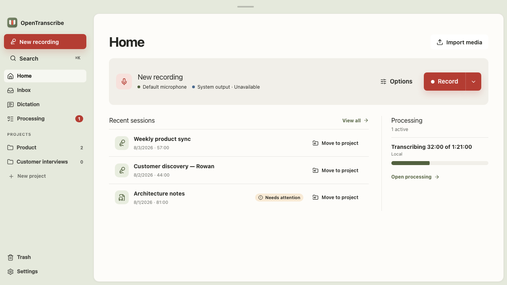
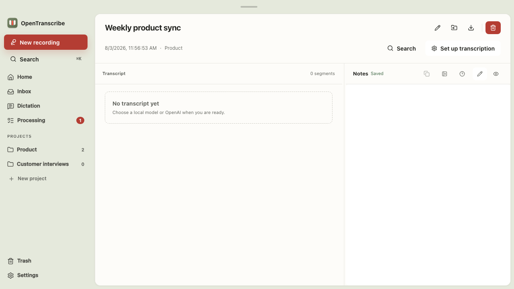
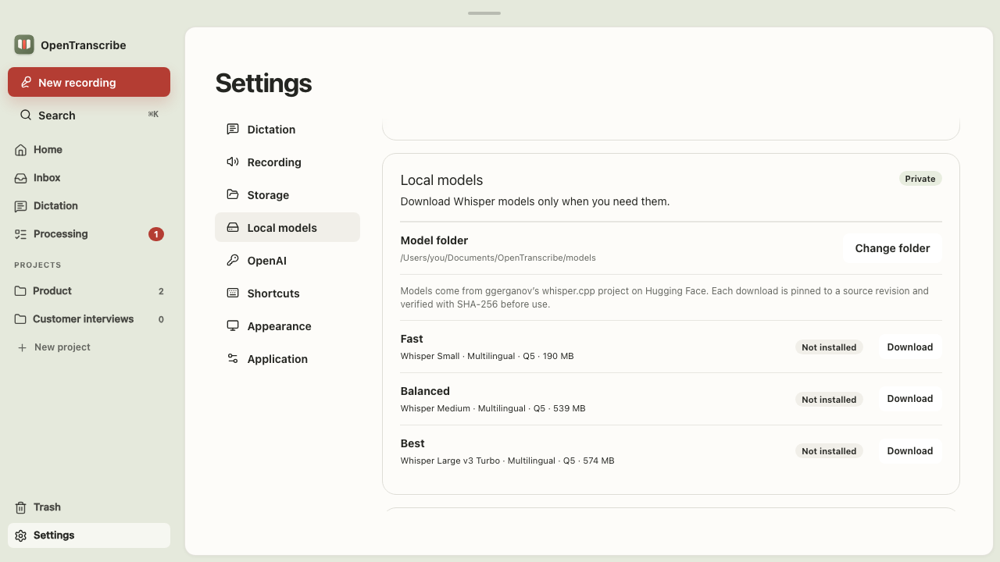

# OpenTranscribe

OpenTranscribe is a local-first desktop meeting workspace. It records audio to
readable files you control, keeps notes beside each session, and can transcribe
completed recordings locally or with an OpenAI API key.

## What it does

| Area              | Features                                                                                                                                                                                                                                                                                                              |
| ----------------- | --------------------------------------------------------------------------------------------------------------------------------------------------------------------------------------------------------------------------------------------------------------------------------------------------------------------- |
| Record            | Capture a microphone and system output as separate tracks, optionally reduce speaker bleed locally with echo cancellation, pause and resume, monitor live levels, control recording from the Dock, tray, menu, or an optional global shortcut, and recover sealed crash-recovery chunks after an interrupted session. |
| Organize          | Keep sessions in an Inbox or named projects, search titles, notes, and transcripts, rename and move sessions, import existing audio or video, and use recoverable Trash rather than deleting work immediately.                                                                                                        |
| Work in a session | Play the mixed or source tracks with a cached waveform, write timestamped Markdown notes, review live captions, edit transcript segments, rename or merge speakers, and export a completed transcript as Markdown, text, JSON, SRT, or VTT.                                                                           |
| Transcribe        | Choose local whisper.cpp transcription after recording, OpenAI file transcription, or OpenAI live captions while recording. Jobs are durable, show progress and estimates where applicable, and can be retried without risking the recording.                                                                         |
| Dictate           | Use a compact dictation panel with its own optional global shortcut. A run snapshots its provider and delivery choices, transcribes after capture, and preserves a history for review.                                                                                                                                |
| Configure         | Guide first-time setup through library selection, audio sources, a transcription preference, and an optional ten-second audio test. Settings cover appearance, capture, keyboard shortcuts, storage, local-model downloads, OpenAI credentials, updates, and application reset controls.                              |

### Screenshots

<p align="center">
  
</p>

<p align="center">
  
</p>

<p align="center">
  
</p>

## How your data stays yours

- Your selected library is the source of truth: sessions stay as readable JSON
  manifests, Markdown notes, PCM WAV tracks, and JSON transcripts. SQLite only
  accelerates search and can be rebuilt from those files.
- Audio never crosses the Tauri IPC boundary, and recording is finalized before
  local inference, uploads, waveform generation, indexing, or export begin.
- Local transcription runs in a supervised sidecar. A sidecar or provider
  failure leaves the completed recording intact for a manual retry.
- OpenAI is optional. Its API key is stored only in the native operating-system
  credential vault, and the interface states when audio will be sent to OpenAI.
- OpenTranscribe has no account requirement, telemetry, hosted sync, or remote
  crash reporting.

OpenAI API keys are stored in the native macOS Keychain, Windows Credential
Manager, or Linux Secret Service vault. See
[`docs/credentials.md`](docs/credentials.md) for storage details and macOS
development prompt behavior.

The project is under active development. It includes microphone and
system-output capture adapters for macOS, Windows, and Linux; separate source
tracks and a mixed playback file; crash-recovery chunks; tray controls; durable
transcription jobs; timestamped notes; local whisper.cpp transcription; OpenAI
file transcription; editable transcripts and speakers; full-text library
search; cached waveform playback; recoverable trash; media import; and Markdown,
text, JSON, SRT, and VTT export. First run configures the library, capture
sources, and default transcription path before a real ten-second audio test.

Microphone echo cancellation is an opt-in local path shared by the macOS,
Windows, and Linux capture adapters. It uses the captured system-output track
as a reference, so it does not rely on a platform-specific Voice Isolation
feature and never sends audio to a service. Physical validation remains
required on every supported operating system because acoustic suppression also
depends on the room, microphone, speaker, and Bluetooth latency. The full
release matrix is in [`docs/platform-validation.md`](docs/platform-validation.md).
OpenAI live transcription is implemented; local transcription runs after the
recording is durably finalized so model latency cannot interrupt capture.

Pull requests run the shared native tests on macOS, Windows, and Linux plus
compile checks for every supported release triple. Trusted `main` and nightly
runs also retain unsigned installers for seven days so current packages can be
smoke-tested before signing is configured.

## Installing a release

Download the installer for your platform from the releases page.

**macOS** ships a separate DMG per architecture: `aarch64` for Apple Silicon
and `x86_64` for Intel. Drag OpenTranscribe to Applications and open it from
there, not from the mounted disk image, so macOS does not run it from a
randomized read-only location that discards capture permissions. Grant
microphone access at the first prompt, then grant Screen & System Audio
Recording in System Settings to capture meeting audio.

Signed releases open with the ordinary confirmation for a downloaded
application. Unsigned preview builds are blocked instead: open System Settings,
go to Privacy & Security, and choose Open Anyway for OpenTranscribe, or clear
the quarantine attribute after moving the app into place.

```bash
xattr -dr com.apple.quarantine /Applications/OpenTranscribe.app
```

**Windows** installers are unsigned, so SmartScreen shows a warning on first
run. Choose More info, then Run anyway. Nothing degrades on later updates.

**Linux** provides an AppImage and a `.deb`, built on Ubuntu 22.04 for systems
with glibc 2.35 or newer. Both need PipeWire 1.0 or newer running for
system-output capture. Mark the AppImage executable before running it.

## Stack

- Tauri 2 and Rust for capture, storage, credentials, and providers
- Vue 3, TypeScript, Pinia, Vue Router, and PrimeVue for the interface
- SQLite FTS as a rebuildable index; JSON, Markdown, and audio files remain the
  durable source of truth
- A versioned MessagePack protocol for the local transcription sidecar

## Repository layout

- `apps/desktop/` is the complete desktop product entrypoint: Vue source,
  frontend tests and tooling, plus the Tauri crate under `src-tauri/`.
- `crates/` contains Rust libraries shared across native processes.
- `sidecars/` contains supervised companion executables such as the local
  transcriber.
- `scripts/`, `tasks/`, and `.github/` contain repository-level automation.
- `docs/` contains product, platform, credential, signing, and design-system
  references.

## Development

Requirements:

- Node.js 22 or newer
- Rust 1.92
- CMake 3.20 or newer for the bundled whisper.cpp sidecar
- Tauri's operating-system prerequisites
- Linux builds also need PipeWire 1.0 or newer development headers
- Go Task is optional; every task delegates to npm or Cargo

```bash
task install
task dev
```

Useful checks:

```bash
task check
task build
task build:native
task build:dmg
APPLE_SIGNING_IDENTITY="Developer ID Application: …" task build:signed:macos
npm --prefix apps/desktop run icons
task types:generate
```

`task dev` is the single hot-reload entrypoint. Stop that process
before starting another instance, and quit any installed or release-bundle
copy of OpenTranscribe, so permission prompts, tray state, and the visible
window stay attached to the development process.

`npm --prefix apps/desktop run icons` regenerates every native application icon
and the dedicated monochrome system-tray icon from the canonical artwork in
`apps/desktop/src/assets/`.

`task types:generate` refreshes the frontend domain contracts from the Rust
domain crate. Commit generated contract changes with the Rust model change that
produced them.

### Local Linux CI

Use Docker to run the Linux CI gates locally before dispatching a GitHub
workflow:

```bash
task ci:linux:docker MODE=native-test
task ci:linux:docker MODE=quality
task ci:linux:docker MODE=release
```

The first command creates a cached Ubuntu 22.04 x86_64 image and Docker volumes
for Rust, npm, browser downloads, and build output. It validates the Linux
dependencies and checks without consuming GitHub Actions minutes.
`frontend-test` and `browser-test` are also available modes. `release` builds
the Linux binary and `.deb`; AppImage bundling still needs a native x86_64 Linux
host because `linuxdeploy` does not run reliably through Docker Desktop's x86
emulation on Apple Silicon. Docker cannot validate macOS or Windows-specific
behavior.

The signed macOS task requires an installed Developer ID Application identity,
builds the app and DMG with that identity, rejects an ad-hoc signature, and
rejects a bundle whose capture entitlements did not survive signing. macOS is
the only platform where signing changes runtime behavior: it binds capture
permissions and Keychain access to the signing identity, so unsigned updates
silently lose both. See [docs/macos-signing.md](docs/macos-signing.md) for
local and CI setup.

Without Task:

```bash
npm --prefix apps/desktop run format:check
npm --prefix apps/desktop run lint
npm --prefix apps/desktop run typecheck
npm --prefix apps/desktop run test
npm --prefix apps/desktop run build
cargo fmt --all --check
cargo clippy --workspace --all-targets --locked -- -D warnings
cargo test --workspace --locked
```

## Data and privacy

OpenTranscribe does not require an OpenTranscribe account. A selected library
contains readable projects and sessions. Downloaded speech models are kept in a
separate configurable folder, defaulting to `OpenTranscribe/models` under the
documents directory. They are shared by every library, removable from Settings,
and fetched from pinned ggerganov/whisper.cpp revisions on Hugging Face with a
SHA-256 verification step before use. OpenAI transcription is opt-in per
session. The API key is entered in the Settings webview, passed directly to the
native credential command, and never written to frontend persistence or the
library. See [PRIVACY.md](PRIVACY.md).

Recording laws and policies vary. Obtain the required participant consent
before recording.

## Licenses

Unless a file says otherwise, this project is available under either the
Apache License 2.0 or the MIT License, at your option.
