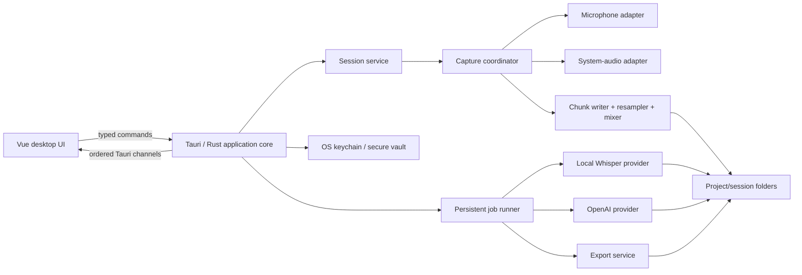
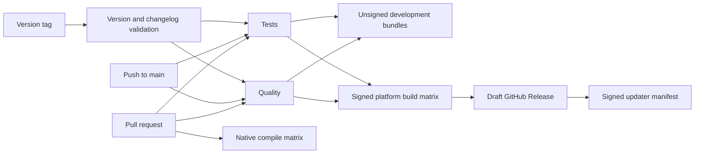

# OpenTranscribe Product Blueprint

Status: Accepted direction; implementation in progress
Date: 2026-07-30

## Implementation status

The repository now contains the recorder MVP foundation and both completed-file
transcription paths:

- Tauri 2, Rust, Vue 3, TypeScript, Pinia, and the warm utility interface
- readable project/session folders backed by a rebuildable SQLite index
- real microphone discovery and 24-bit, ten-second crash-recovery chunks
- pause, resume, stop, validated chunk consolidation, recovery detection and
  user-triggered finalization, notes, and transcript persistence
- native playback from repository-scoped audio artifacts and reveal-in-folder
- operating-system credential-vault storage for a bring-your-own OpenAI API key
- completed-file OpenAI transcription with provider-safe WAV chunking at the
  25 MB file boundary, timed speaker segments from the diarized response, and
  upload-chunk timeline offsets
- pinned model-catalog downloads with size and SHA-256 verification plus
  supervised whisper.cpp file transcription
- one-click record-only, record-then-transcribe-locally, and
  record-then-transcribe-with-OpenAI actions
- a compact per-session Options control for title, project, microphone, system
  output, transcription mode, and provider language hint
- persisted appearance, microphone, and capture defaults plus canonical
  transcript-segment editing
- pause-aware recording time so the dock, saved duration, and timestamped notes
  stay aligned with playback
- failure-safe staged audio/video import from the Home action, native
  drag-and-drop, or the app menu, plus atomic Markdown, text, JSON, SRT, and VTT
  export
- a compact Buzz-inspired desktop shell with a macOS overlay title bar
- a versioned MessagePack sidecar protocol for the local runtime
- ScreenCaptureKit system capture on macOS, WASAPI loopback on Windows, and a
  PipeWire sink-monitor adapter on Linux
- separate microphone and system tracks plus a synchronized mixed playback file
- tray controls and durable transcription jobs with crash recovery and retry
- cooperative job cancellation, speaker rename/merge, session search, and
  SQLite-backed library search across titles, transcripts, and notes
- recoverable session trash, standardized imported audio, and cached waveform
  summaries for completed recordings and imports
- storage-location controls, an in-app shortcut reference, keyboard recording
  flows, and timestamped-note search results that seek playback
- an opt-in global record/stop shortcut with three validated presets,
  persisted selection, native conflict status, and serialized recording actions
- idle window-focus refresh for valid external library edits and stale-index
  removal without overwriting an open notes editor
- compact first-run setup with persisted source/provider defaults, recording
  consent guidance, and a real ten-second record-and-playback source test
- platform-aware system-audio support and permission status, plus a direct
  macOS permission recovery action
- pull-request compile checks, seven-day unsigned installer artifacts from
  `main` and nightly, and protected release-draft workflows
- deterministic mocked provider-contract tests for OpenAI multipart requests and
  the local sidecar progress/final/error event stream
- a process-level Hello/Ready/Shutdown smoke test for the compiled local
  transcriber protocol boundary
- automated light/dark WCAG A/AA scans across every primary route, keyboard
  workflow coverage, and browser-error detection for portal/runtime failures

Still open before the recorder MVP is release-ready:

- physical Windows and Linux capture validation and final macOS permission-flow
  validation
- platform signing/notarization credentials and signed updater configuration
- hardware capture, interruption, low-disk, sleep/wake, and long-duration soak
  validation on every supported operating system

## Executive decision

OpenTranscribe should be a local-first desktop meeting workspace, not just a recorder with a transcript attached.

The product promise is:

> Record locally. Transcribe your way. Keep the meeting memory you created.

The primary object is a **session**: one meeting, interview, lecture, voice memo, or imported recording. A session combines:

- separate microphone and system-audio recordings
- a synchronized transcript
- notes written during or after the recording
- speakers, markers, decisions, and action items
- processing history and export artifacts

The first release should prioritize reliable recording and after-the-fact transcription. Realtime transcription is valuable, but it should be the next layer rather than a dependency of recording. A failed network request or local model must never endanger the audio.

The implemented stack is Tauri 2, Vue 3, TypeScript, Pinia,
PrimeVue-backed application controls, CSS semantic tokens, and a Rust core.

## Product principles

### Local-first, visibly so

Every recording lands on disk immediately. The interface always makes the current data boundary clear:

- **On this device** for local recording and local transcription
- **Sent to OpenAI** when a cloud model is selected
- **Not yet processed** when only audio is available

The library must remain usable without an account or internet connection.

### The recording is sacred

Audio capture, storage, transcription, summarization, and export are separate stages. Recording continues if transcription disconnects. A crash should leave recoverable chunks rather than one corrupt file.

### One-click for the common case, explicit controls for the uncommon case

The main Record button starts with the user's saved defaults. Its adjacent menu
offers quick local or OpenAI transcription choices, while a compact Options
control exposes source selection, project, language, title, and transcription
mode without turning every recording into a setup wizard.

### Progress should be honest

Do not show invented percentages. Show the most concrete signal available:

- elapsed recording time and source levels while capturing
- bytes uploaded during upload
- processed audio time for local transcription
- emitted transcript segments for streamed file transcription
- an indeterminate state when the provider exposes no measurable progress

### Notes and transcript are peers

The user's notes are not a generated summary field. Notes remain editable Markdown and are visible during the meeting. Generated summaries, decisions, and action items should cite the transcript timestamps that support them.

### No invisible recording

The recording state must always be obvious in the app and system tray/menu bar. First-run guidance should remind users to obtain participant consent and comply with applicable policies and laws.

## Research synthesis

The strongest pattern in current meeting products is bot-free capture from microphone plus system audio. Granola describes this model directly and pairs it with an editable note plus a hideable live transcript. Krisp similarly treats microphone and speaker audio as the meeting source. Otter emphasizes live transcription, speaker recognition, searchable meeting memory, summaries, and action items.

The opportunity for OpenTranscribe is to combine those useful interaction patterns with a stronger ownership model:

1. **No meeting bot.** Capture locally across Zoom, Meet, Teams, browser calls, and in-person meetings.
2. **No forced cloud.** The user chooses local or OpenAI processing per session.
3. **Real files.** Projects and sessions are visible, portable folders rather than records trapped in an opaque database.
4. **A working document.** Notes can be written during the meeting and linked to exact moments.
5. **A durable queue.** Recording, importing, transcription, summarization, and export are resumable jobs with visible states.

The Buzz reference contributes the visual language rather than the product model:

- a native-feeling desktop frame
- a lightly tinted, low-contrast sidebar
- a large quiet content surface
- minimal borders and restrained elevation
- conversational content with generous line height
- compact controls that appear where the work happens
- a persistent status area near the bottom of the main surface

OpenTranscribe should borrow that calm hierarchy without copying Buzz's channel-oriented information architecture.

### OpenOats implementation study

OpenOats is the closest useful implementation reference found so far. Its current codebase is a native macOS 15+ SwiftUI application rather than a Tauri application, but it proves several parts of this product direction:

- local live transcription with Whisper Base, Whisper Small, and Whisper Large v3 Turbo through WhisperKit/Core ML
- additional local ASR backends for Parakeet and Qwen
- separate microphone and system-audio transcription paths labeled as the local and remote sides
- local LLM and embedding options through Ollama, separate from speech recognition
- model download detection, progress, disk-size estimates, and hardware-aware setup recommendations
- append-only `transcript.live.jsonl`, atomically replaced `transcript.final.jsonl`, canonical `session.json`, and user-facing `notes.md`
- preservation of raw ASR text when an optional LLM-refined display version is generated

This is useful confirmation that **local ASR, local LLMs, and local embeddings are three separate capabilities**. Ollama runs models such as Llama or Qwen for notes, suggestions, and retrieval. Whisper Large v3 Turbo runs through a speech-specific runtime.

Patterns worth adopting:

1. A model-agnostic transcription backend instead of hardwiring the app to one ASR family.
2. Separate backend instances and transcript streams for microphone and system audio.
3. Explicit download, prewarm, readiness, disk, and hardware states in onboarding.
4. Append live transcript records immediately, then write a higher-quality final transcript atomically.
5. Preserve raw transcription when generating cleaned text.
6. Carry trailing transcript context into each local chunk to improve continuity.
7. Treat output-device changes and Bluetooth reconnects as first-class capture events.

Patterns not to copy directly:

- WhisperKit and Core Audio process taps are Apple-specific, so they cannot be the cross-platform foundation.
- A single temporary recording finalized at the end is less crash-tolerant than short recovery chunks.
- Model assets should live in managed application data, not inside the user's meeting library.
- Hiding the app from screen sharing may prevent accidental disclosure, but it must not become a stealth-recording mode. The local recording indicator should remain unmistakable.

The practical result is to keep `whisper.cpp` as the first shared runtime while designing the local-ASR boundary so an optimized WhisperKit backend on Apple hardware, or Parakeet/Qwen backends on supported hardware, can be added later without changing the session model or UI.

## Information architecture

Use two durable levels initially:

1. **Project** — a user-defined container such as a client, course, product, podcast, or research topic.
2. **Session** — a recorded or imported piece of audio and everything derived from it.

Tags, starred items, speakers, and smart views can provide cross-project organization without introducing another required folder level.

### Sidebar

The sidebar should be approximately 248 pixels wide and contain:

- a prominent **New recording** control
- global search
- **Home**
- **Today**
- **Processing**
- **Starred**
- a collapsible **Projects** section
- the current library location
- local-model download or readiness status
- Settings

The sidebar should not contain separate navigation for every artifact type. Audio, transcripts, notes, summaries, and exports belong inside their session.

### Main content pane

The pane changes with the selected context:

- **Home:** start-recording hero, active processing, and recent sessions
- **Project:** project title, search/filter controls, and a compact session list
- **Live session:** transcript and notes with a persistent recording dock
- **Completed session:** audio player, transcript, notes, summary, and export actions
- **Processing:** an inspectable job queue with retry and cancel actions
- **Settings:** recording, models, providers, storage, shortcuts, and privacy

An optional right inspector may be added later for speaker management and session metadata. It should be a temporary drawer, not permanent third-column chrome.

## Core screen concepts

### Home

Home should answer three questions immediately:

1. Can I start recording?
2. Is anything still processing?
3. Where is my latest meeting?

The primary action is a large Record button with a smaller options menu. Beneath it:

- source readiness: microphone, system audio, and permissions
- the current default: `Record only`, `Live with OpenAI`, or `Live locally`
- active jobs, if any
- recent sessions grouped by Today, Yesterday, and Earlier

Avoid dashboard metrics. Minutes transcribed and storage totals belong in Settings or a future usage view.

### Live session

The live session is the product's hero surface.

```text
┌────────────── Sidebar ──────────────┬──────────────── Main session ────────────────┐
│ Search                              │ Weekly product sync             00:34:18      │
│ + New recording                    │ Product / Roadmap                              │
│                                    ├──────────────────────────┬─────────────────────┤
│ Home                               │ Live transcript          │ My notes            │
│ Today                              │                          │                     │
│ Processing  2                      │ Alex  10:32              │ ## Decisions        │
│ Starred                            │ We should ship the...    │ - Keep local-first  │
│                                    │                          │                     │
│ Projects                           │ You  10:33               │ ## Follow-ups       │
│  Product                           │ I can take the capture...│ - Benchmark Windows │
│  Customer interviews              │                          │                     │
│  Personal                          │                          │                     │
│                                    ├──────────────────────────┴─────────────────────┤
│ Local model: Ready                 │ ● 00:34:18  ▁▃▆▂▅▇▃  Mic ✓  System ✓  Pause ■ │
│ Settings                           │ Live transcript connected                      │
└────────────────────────────────────┴────────────────────────────────────────────────┘
```

Desktop uses a resizable transcript/notes split. At narrower widths, Transcript and Notes become two views controlled by a compact switch.

The bottom recording dock stays visible and shows:

- record/pause/stop
- elapsed time
- independent microphone and system levels
- dropped-frame or device-warning state
- disk destination
- transcription connection state

The transcript should distinguish **partial** text from **final** text without visual noise. A subtle lower opacity is enough. When a final segment arrives, it replaces the partial segment in place.

### Completed session

The completed view preserves the live layout but adds:

- a scrubber with waveform and timestamp
- session title, date, duration, project, and processing state
- transcript search
- speaker rename and merge
- a summary block with decisions and action items
- export and reveal-in-folder actions

Clicking a transcript segment or note timestamp seeks the audio. Pressing a marker shortcut while recording inserts a timestamped bullet in the notes.

### Processing view

Each job row shows its current stage instead of a single ambiguous progress bar:

```text
Customer interview 07
Uploading 18.2 MB of 31.4 MB
████████████░░░░░░░░  58%

Weekly product sync
Local transcription · 24:10 of 51:42
█████████░░░░░░░░░░░  47%

Design critique
Waiting for network · audio is safe on this device
[Retry now] [Use local model]
```

## Interaction flows

### First run

1. Choose a library folder.
2. Explain the two audio sources.
3. Request microphone permission.
4. Request system-audio or screen-recording permission only when needed.
5. Choose the default transcription path:
   - decide after recording
   - local model
   - OpenAI
6. If local is selected, offer model downloads with plain-language speed and quality labels.
7. If OpenAI is selected, explain API billing and accept an API key.
8. Run a ten-second source test and play it back.

Do not require an OpenTranscribe account.

### Start a recording

The default Record action starts immediately after permissions are available.

The compact Options control supports:

- project
- microphone device
- system audio on/off
- transcription mode
- language or automatic detection
- meeting title

The app creates the session directory and first recovery chunk before showing the recording as active.

### Stop a recording

1. Stop capture streams.
2. Finalize active chunks.
3. Persist the session manifest.
4. Make the session immediately playable.
5. Queue the chosen transcription job.
6. Merge or compress recovery chunks in the background.

The user can close the window after step 4. The tray/menu-bar item should indicate background work.

### Import a file

Drag audio or video onto Home, use `File → Import`, or choose Import beside the Record control.

The app copies the file into the session by default. A future advanced option may reference external files in place, but copied media is more portable and deterministic for the first release.

### Recover after a crash

On launch, scan for sessions with open recovery chunks:

1. show “Recovered recording” with its known start time
2. finalize readable chunks
3. preserve any incomplete tail separately
4. let the user play, rename, discard, or continue processing the recovered session

Never silently delete recovery data.

## Visual system

### Direction

Use a **warm utility** aesthetic: quiet, tactile, and native rather than futuristic.

- content background: warm white
- sidebar: muted pollen or lichen tint
- primary text: charcoal with a slight green undertone
- secondary text: neutral gray-green
- recording: warm coral red
- active/transcribing: moss green
- processing: ochre
- error: deep red

Suggested starting tokens:

```text
canvas:          #F7F7F3
surface:         #FFFFFF
sidebar:         #ECEFC9
sidebar-active:  #DDE3B8
ink:             #20231E
ink-muted:       #6F756B
line:            #E2E4DD
record:          #E95C52
live:            #669B58
processing:      #B8842E
```

These are design starting points, not implementation commitments. Contrast must be checked before adoption.

### Typography and density

- Geist or Inter for cross-platform consistency
- 14–15 px body text
- 12–13 px metadata
- 20–24 px session titles
- 1.45–1.6 line height for transcript and notes
- long-form content limited to a readable measure

Use a 4 px spacing base with most layout rhythm on 8, 12, 16, 24, and 32 px.

### Shape and elevation

- 10–12 px controls
- 14–16 px large surfaces and dialogs
- thin dividers before borders
- shadows only for floating menus, dialogs, and the recording dock
- no nested card grids

### Motion

- 120–180 ms control and navigation transitions
- gentle live waveform movement
- one restrained pulse on the recording indicator
- partial transcript text resolves in place
- respect reduced-motion settings

### Native behavior

- macOS traffic-light-safe title bar
- Windows system-menu and snap-layout compatibility
- tray/menu-bar controls for pause, stop, and open
- global shortcuts, configurable and disabled by default until accepted
- system light/dark theme support before the first stable release

## Data on disk

The user's library is the durable source of truth. A rebuildable SQLite index may provide fast search and job recovery, but the sessions must remain intelligible without the database.

```text
OpenTranscribe/
  Product/
    2026-07-29 1030 Weekly product sync/
      session.json
      notes.md
      audio/
        microphone.wav
        system.wav
        mixed.wav
        waveform.json
      transcript/
        transcript.json
        transcript.md
        provider-response.json
      summary.md
      exports/
        weekly-product-sync.txt
        weekly-product-sync.srt
  Customer interviews/
    2026-07-28 1400 Interview 07/
      ...
  .opentranscribe/
    index.sqlite
    jobs.sqlite
```

While recording:

```text
audio/.recovery/
  microphone-000001.wav
  microphone-000002.wav
  system-000001.wav
  system-000002.wav
```

### `session.json`

The manifest should include:

- schema version
- stable session ID
- title and project
- created, started, and ended timestamps
- capture sources and device labels
- audio artifact paths and durations
- transcript and summary states
- selected provider and model IDs
- non-secret processing metadata
- recovery state

API keys, account tokens, and provider secrets must never appear in the library.

### Transcript representation

`transcript.json` should retain stable segment IDs with:

- start and end time
- text
- speaker ID and display label
- track source: microphone, system, mixed, or imported
- final/partial state while live
- provider confidence when supplied

`transcript.md` is a convenient derived export. The JSON representation remains canonical because Markdown alone cannot preserve accurate timing and speaker metadata.

## Technical architecture



### Frontend responsibilities

- shell, routing, focus, keyboard interaction, and responsive layout
- rendering waveform summaries, transcript segments, notes, and jobs
- transient editing state
- typed calls into Rust
- no direct access to provider secrets
- no audio capture or model execution in the webview

### Rust responsibilities

- audio devices and permissions
- capture coordination and drift correction
- crash-safe file writing
- session manifests and library indexing
- job persistence and recovery
- OpenAI network client
- local model lifecycle and inference
- credential storage
- export generation
- typed progress streams to the frontend

Tauri recommends channels for ordered, high-throughput streaming data. Use commands for discrete actions and channels for recording levels, transcript deltas, and job progress.

### Suggested Rust module boundaries

```text
apps/desktop/src-tauri/src/
  app/
    commands.rs
    state.rs
  audio/
    capture.rs
    coordinator.rs
    devices.rs
    writer.rs
    resample.rs
    macos.rs
    windows.rs
    linux.rs
  sessions/
    manifest.rs
    repository.rs
    recovery.rs
  transcription/
    provider.rs
    local_whisper.rs
    openai.rs
    segments.rs
  jobs/
    job.rs
    runner.rs
    repository.rs
  exports/
    markdown.rs
    subtitles.rs
    text.rs
  credentials/
    store.rs
```

Avoid a giant `commands.rs` or `lib.rs`. Tauri commands should translate UI requests into calls on focused services.

## Audio capture strategy

Microphone capture can use CPAL as the shared abstraction. System-output capture requires a platform adapter.

| Platform | Recommended path                               | User-facing permission                       | Main risk                                                      |
| -------- | ---------------------------------------------- | -------------------------------------------- | -------------------------------------------------------------- |
| macOS    | ScreenCaptureKit audio plus microphone or CPAL | Microphone and Screen Recording/System Audio | permission behavior, signing identity, and stream interruption |
| Windows  | WASAPI loopback plus CPAL microphone           | Microphone                                   | endpoint changes, format negotiation, and device hot-swap      |
| Linux    | PipeWire sink-monitor capture plus microphone  | Depends on distribution and audio stack      | PipeWire/ALSA variation and sandbox packaging                  |

Keep microphone and system audio as separate tracks. This provides:

- independent gain and mute
- better echo troubleshooting
- a reliable `You` speaker label from the microphone track
- the ability to reprocess or remix later
- better remote-speaker diarization on the system track

The capture coordinator should:

1. negotiate each device's native format
2. timestamp frames against a monotonic clock
3. buffer briefly in lock-free or bounded queues
4. resample into a common internal timeline
5. write independent crash-safe chunks
6. emit low-rate level summaries to the UI
7. create a mixed preview without destroying the originals

Do not send raw high-frequency audio buffers through Tauri IPC.

## Transcription strategy

### Provider interface

Both cloud and local implementations should expose the same product-level operations:

```text
capabilities()
transcribe_file(session, options, progress_channel)
start_live(session, options, transcript_channel)
cancel(job_id)
```

Capabilities should describe:

- file transcription
- realtime or near-realtime transcription
- timestamps
- speaker diarization
- language detection
- translation
- prompt or vocabulary context

The UI should be capability-driven so it does not offer unavailable combinations.

### OpenAI

As of this blueprint:

- `gpt-transcribe` provides high-quality completed-recording text, but its JSON
  response does not provide the timed segments required by this product.
- `gpt-realtime-whisper` is the recommended Realtime transcription model.
- `gpt-4o-transcribe-diarize` provides the speaker-labeled, timestamped segments
  used by the completed-session transcript, seeking, and subtitle exports.
- the file endpoint supports streamed transcript events for completed recordings.
- Realtime transcription emits partial deltas and final committed turns.
- speaker diarization is not available in Realtime transcription sessions.

This suggests three clear modes:

1. **Cloud after recording:** `gpt-4o-transcribe-diarize`
2. **Cloud live:** `gpt-realtime-whisper`, followed by an optional final file pass
3. **Cloud text-only compatibility:** `gpt-transcribe`

For long recordings, create upload artifacts that satisfy the provider's supported format and size limits. Preserve original audio locally and create provider-specific temporary chunks rather than degrading the source recording.

### API key and account model

Do not promise “Sign in with ChatGPT.” ChatGPT subscriptions and API billing are separate, and a normal ChatGPT subscription does not provide third-party API usage.

The first practical integration is **bring your own API key**:

- accept the key in Settings
- store it using the operating system credential store or Tauri Stronghold
- use it only from the Rust process
- show only its last few characters
- provide Test connection and Remove actions
- never log or write it to session metadata

A future hosted product could provide OpenTranscribe accounts and proxy provider access through an OpenTranscribe backend. That is a separate business, billing, privacy, and security decision—not a small OAuth addition.

### Local Whisper

Whisper is a speech model and does not run through Llama. `whisper.cpp` is the most practical first native runtime because it supports macOS, Windows, and Linux, CPU inference, multiple GPU backends, quantization, voice activity detection, and the Whisper large-v3 family.

OpenOats demonstrates another valid Apple-specific path: Whisper Large v3 Turbo through WhisperKit/Core ML. Its implementation transcribes 16 kHz mono floating-point chunks, primes later chunks with trailing context from the prior result, and reports the Large v3 Turbo model download at roughly 800 MB. That path is compelling for Apple Silicon, but it should be an optional backend rather than the only local implementation.

The first model manager should offer plain-language presets:

- **Fast:** small or small.en
- **Balanced:** medium
- **Best quality:** large-v3-turbo

The exact available builds should be described by a signed model manifest so downloads, hashes, disk sizes, and compatibility remain explicit.

Local “live” Whisper is near-realtime rather than natively streaming. It requires rolling windows, voice activity detection, overlap, and reconciliation of unstable partial text. Implement it after reliable file transcription. Do not present fluctuating partial text as final.

The ASR provider contract should not use Whisper-specific names. A future version should be able to recommend Parakeet for fast English transcription or another supported speech model without changing the rest of the application.

Local speaker diarization should be a later, separate provider decision. It is not part of Whisper itself, and many strong diarization stacks add Python, model-license, authentication-token, or packaging complexity.

### Summaries and action items

Treat post-processing as separate from transcription:

```text
audio → transcript → summary / decisions / action items
```

This enables:

- local transcription with cloud summarization
- cloud transcription with no summarization
- fully local processing when a future local language model is installed
- re-running a summary without re-transcribing audio

Generated outputs should keep timestamp citations back to transcript segments. The user's notes should be included as privileged context but never overwritten.

## Session and job states

### Session state

```text
draft
recording
paused
finalizing
recorded
processing
ready
needs_attention
```

### Job state

```text
queued
preparing
uploading
transcribing
post_processing
completed
failed
canceled
```

A session may have multiple jobs. Its audio can be `recorded` even while a transcript job is `failed`.

### Progress event

Use one typed progress event across providers:

```json
{
  "job_id": "01J...",
  "stage": "transcribing",
  "completed_units": 1450,
  "total_units": 3102,
  "unit": "audio_ms",
  "message": "Transcribing 00:24 of 00:52"
}
```

`total_units` is optional. The UI becomes indeterminate when it is absent.

## MVP scope

### Include

- macOS, Windows, and Linux capture adapters behind one interface
- a capture feasibility spike on all three platforms before the UI is built deeply
- project and session folders
- microphone plus system-audio capture
- crash-safe chunks and recovery
- record, pause, resume, and stop
- import audio/video
- playback and waveform overview
- notes during recording
- OpenAI file transcription
- local Whisper file transcription
- timestamped transcript segments
- persistent processing queue with retry
- transcript and notes search within a session
- Markdown, text, JSON, SRT, and VTT export
- reveal in file manager
- keyboard shortcuts
- tray/menu-bar recording controls

### Defer

- calendar integration and automatic meeting detection
- meeting bots
- team accounts, sharing, and collaboration
- mobile apps
- cloud sync
- local speaker diarization
- fully local summaries
- automatic CRM or task-manager updates
- transcript-wide conversational search across the whole library
- plugin marketplace

### Realtime sequencing

Do not make realtime transcription a release blocker for the reliable recorder MVP.

1. ship recording plus local/cloud after-the-fact transcription
2. add OpenAI Realtime transcription
3. add local near-realtime Whisper
4. evaluate live translation and live summary separately

## Delivery plan

### Phase 0 — Capture proof

Build a headless or minimal-window capture harness for every platform.

Exit criteria:

- simultaneous microphone and system capture for at least 60 minutes
- separate playable tracks
- acceptable drift after one hour
- device disconnect and default-device change behavior documented
- permission denial and recovery verified
- forced-process termination leaves recoverable audio
- no feedback from OpenTranscribe's own playback into the system track where the platform supports exclusion

If this phase fails on a platform, adjust the release matrix before investing in the full shell.

### Phase 1 — Library and recorder

- Tauri/Vue foundation
- sidebar and Home
- project/session repository
- recording dock
- recovery chunks
- playback
- notes
- tray/menu-bar controls

### Phase 2 — File transcription

- provider contract
- persistent job runner
- OpenAI BYOK flow
- OpenAI file transcription
- local model manager
- whisper.cpp file transcription
- transcript rendering and editing
- truthful stage progress

### Phase 3 — Meeting workspace

- synchronized transcript/audio seeking
- markers and timestamped notes
- speaker rename/merge
- summaries, decisions, and actions
- exports
- session search

### Phase 4 — Realtime

- OpenAI Realtime WebSocket pipeline
- partial/final segment reconciliation
- reconnect behavior with a local audio backlog
- final higher-quality file pass
- local near-realtime experiment

### Phase 5 — Cross-platform release hardening

- macOS signing and notarization
- Windows installer signing
- Linux AppImage/deb packaging, with Flatpak evaluated separately
- updater signing
- accessibility and keyboard pass, including light and dark automated route
  scans
- dark mode
- long-recording soak tests
- crash and low-disk testing
- privacy copy and consent reminders

## GitHub Actions and release automation

The local MarketingPlatform and GriffLab repositories provide a good starting
shape, but not a workflow set that should be copied unchanged. MarketingPlatform
contains the older version; GriffLab improves it with thin entry workflows,
reusable `workflow_call` jobs, read-only default permissions, deterministic
installs, Taskfile commands shared with local development, separate failure
surfaces, and retained Playwright artifacts.

OpenTranscribe should adopt that composition while replacing the
server-oriented Docker, PostgreSQL, Redis, Terraform, package cleanup, and SSH
deployment jobs with native desktop builds, code signing, and GitHub Releases.

### Proposed workflow files

| File                | Trigger                         | Responsibility                                                                                                                                |
| ------------------- | ------------------------------- | --------------------------------------------------------------------------------------------------------------------------------------------- |
| `pull-request.yaml` | pull requests to `main`, manual | Thin, read-only caller for quality, tests, and native compile checks                                                                          |
| `pipeline.yaml`     | pushes to `main`, manual        | Re-run required checks, then create unsigned development bundles for all supported platforms                                                  |
| `quality.yaml`      | reusable, manual                | Agent guidance check, frontend lint/type-check/build, Rust format and Clippy                                                                  |
| `test.yaml`         | reusable, manual                | Frontend units, Rust units, provider contracts, storage migrations, and headless workspace UI tests                                           |
| `native-build.yaml` | reusable, manual                | Platform matrix for macOS, Windows, and Linux Tauri bundles                                                                                   |
| `release.yaml`      | version tag or manual           | Validate version, build preview installers, and create a draft GitHub Release; signed updater metadata remains gated on signing configuration |
| `nightly.yaml`      | schedule, manual                | Full matrix build, longer fixtures, migration/recovery tests, dependency audit, and optional lab-runner audio tests                           |
| `dependabot.yml`    | weekly                          | GitHub Actions, npm, and Cargo dependency updates                                                                                             |



Keep the caller workflows intentionally small. The reusable workflows become
the single definitions for checks used by pull requests, `main`, nightlies, and
releases.

### Shared local and CI commands

Follow GriffLab's Taskfile pattern so contributors and Actions invoke the same
commands:

```text
task check
task lint
task format:check
task typecheck
task test
task test:ui
task build
task build:native
```

Each task should be a thin composition over the real package commands. Actions
must use locked installs such as `npm ci` and `cargo ... --locked`. A formatting
or lint command must not mutate the checkout; retain a final
`git diff --exit-code` guard to expose tools that write unexpectedly.

### Pull-request gates

The required pull-request checks should be:

1. repository guidance and generated-agent targets are current
2. frontend lint, formatting, type-check, and production web build
3. `cargo fmt --check` and Clippy with warnings treated as errors
4. frontend and Rust unit tests
5. storage schema and recovery fixture tests
6. mocked OpenAI and local-provider contract tests
7. headless UI tests with reports uploaded even on failure
8. native `cargo check` or minimal Tauri compile on macOS, Windows, and Linux

Do not give pull-request jobs secrets, including an OpenAI key. Provider tests
must use recorded or generated fixtures and a local mock server. Pull requests
from forks must remain useful without privileged credentials.

GitHub-hosted runners cannot prove microphone/system-audio capture behavior.
Keep capture adapters behind contracts, exercise their deterministic logic in
CI, and run the real device, permission, sleep/wake, and drift suite manually
until dedicated lab runners exist. If lab runners are added, isolate them in a
protected runner group and trigger them nightly or manually rather than for
untrusted pull-request code.

### Native build matrix

The initial matrix should build:

- macOS Apple Silicon and Intel targets, combined into a universal bundle only
  if the native audio dependencies support it cleanly
- Windows x64, with ARM64 deferred until the capture stack is validated there
- Linux x64 AppImage and deb packages

Pull requests need compile confidence, not distributable signed applications.
Create unsigned, short-retention artifacts on `main` and nightly runs so the
team can install and smoke-test current builds. Reserve signing and notarization
credentials for the release workflow.

Use `tauri-apps/tauri-action` as the starting release implementation because it
supports the platform build matrix, GitHub Release assets, workflow artifacts,
updater signatures, and updater JSON. Pin third-party Actions to reviewed full
commit SHAs; let Dependabot propose controlled updates rather than following
mutable tags.

Each platform build should upload its installers as a workflow artifact. A
single publish job downloads the completed artifact set and creates the draft
GitHub Release, avoiding concurrent matrix jobs racing to upload assets.

### Signing and release boundary

`release.yaml` should target a protected `release` environment. Only its final
publish job needs `contents: write`; platform builds stay read-only. It should
receive named secrets rather than
`secrets: inherit`:

- Tauri updater private key and password
- Apple signing certificate, certificate password, team identity, and
  notarization credentials
- Windows code-signing credential or short-lived cloud-signing identity

The updater public key belongs in application configuration; the private key
exists only in the protected release environment. Require environment approval
at first. Prefer short-lived identity federation when the selected Apple or
Windows signing service supports it.

A release should:

1. confirm the tag, Tauri configuration, npm package, and Cargo package versions
   agree
2. run the same quality and test workflows as a pull request
3. build on each target operating system rather than cross-compiling installers
4. sign and notarize the platform packages
5. upload checksums, installers, updater artifacts, and `.sig` files to a draft
   release
6. smoke-install the artifacts where runner automation permits
7. validate the generated updater manifest and download URLs
8. require a human to publish the draft during the early release period

Never publish `latest.json` before every supported updater artifact and
signature is present. Otherwise existing installations can discover a release
that they cannot safely install.

### Permissions, concurrency, and artifacts

- set `permissions: contents: read` at the top of normal workflows
- elevate only the release job that uploads assets
- avoid `write-all` and broad inherited secrets
- cancel superseded pull-request runs with a branch-specific concurrency group
- never cancel a release once signing or publishing has begun
- cache npm and Cargo downloads; use `target` caching only after measuring its
  size and hit rate
- upload test reports on failure and unsigned bundles only from trusted branch
  runs
- use short retention for development bundles and normal GitHub Release
  retention for published installers
- protect `main`, forbid force pushes/deletions, require the named checks, and
  require conversation resolution

### Patterns to copy, adapt, and leave behind

| Sibling pattern                                                 | Decision for OpenTranscribe                                         |
| --------------------------------------------------------------- | ------------------------------------------------------------------- |
| Thin PR/pipeline callers                                        | Copy                                                                |
| Reusable quality and test workflows                             | Copy                                                                |
| Taskfile as local/CI contract                                   | Copy                                                                |
| Locked npm installs and dependency caches                       | Copy                                                                |
| Separate frontend, backend/core, and UI-test jobs               | Adapt to frontend, Rust core, provider contracts, and native matrix |
| Always-uploaded Playwright diagnostics                          | Copy                                                                |
| Matrix-driven build template                                    | Adapt to operating systems and architectures                        |
| GitHub environment for production deployment                    | Adapt to the protected release/signing environment                  |
| Broad `write-all` permissions                                   | Do not copy                                                         |
| `secrets: inherit` on privileged jobs                           | Do not copy                                                         |
| Automatic server deployment after every push to `main`          | Do not copy                                                         |
| Docker image, GHCR cleanup, Terraform, and SSH deploy workflows | Do not copy                                                         |
| Repository variables that bypass required PR checks             | Do not add initially                                                |

Implement `quality.yaml` and `test.yaml` with the Phase 0 scaffold. Add the
native matrix as soon as the capture proof compiles on all intended platforms.
Add signing and updater publication only after unsigned installers have been
manually validated; release automation should not be on the critical path for
proving audio capture.

## Verification plan

### Audio

- unit tests for ring buffers, resampling, timestamps, mixing, and state transitions
- golden audio fixtures for channel count, duration, and drift
- one-hour and two-hour soak recordings
- mic unplug/replug
- Bluetooth device changes
- default output changes
- sleep/wake
- low disk
- process kill during an active chunk

### Transcription

- fixed audio fixtures with expected timestamps and language
- mocked OpenAI streams for deltas, final segments, disconnects, retries, and rate limits
- local model cancellation and restart
- long-file chunk boundaries without duplicated or missing text
- provider capability tests

### Storage

- manifest migrations by schema version
- atomic write and recovery tests
- library move and re-index
- paths with Unicode and long names
- no credential material in the library or logs

### UI

- keyboard-only recording and stop flow
- screen-reader labels and live-region restraint
- narrow and large window layouts
- reduced motion
- permission-denied, offline, empty, processing, failed, and recovered states
- visible recording state in window and tray/menu bar

## Important product risks

### Cross-platform capture parity

System audio is three platform integrations hidden behind one product promise. Mitigation: make capture the first technical spike, retain platform adapters, and keep UI behavior capability-driven.

### Audio drift

Microphone and system devices can use different clocks. Mitigation: monotonic timestamps, bounded buffers, periodic drift measurement, and resampling into a shared timeline.

### False confidence in progress

Cloud providers may not expose a numeric transcription percentage. Mitigation: stage-based progress and indeterminate states instead of simulated percentages.

### Long uploads

Provider file limits and unstable networks make a one-file upload fragile. Mitigation: create provider-specific compressed chunks, persist job checkpoints, and retain original audio locally.

### Local-model expectations

Large models can be slow or consume several gigabytes. Mitigation: a benchmark during setup, model presets, explicit download and memory information, and no claim that every machine can run the highest-quality model live.

### Recording consent

A cross-app recorder can be used in contexts with different consent requirements. Mitigation: unmistakable recording indicators, first-run education, optional recurring reminders, and no stealth mode.

## Decisions to make after the capture proof

1. Which operating systems are in the first public release: all three, or macOS and Windows with Linux beta?
2. Should the default recording artifact be lossless-only, or lossless tracks plus an automatically generated compact mixed copy?
3. Is OpenAI BYOK sufficient for the first release, or is a hosted OpenTranscribe account part of the intended business?
4. Should summaries be in the first stable release or arrive immediately afterward?
5. Does editing modify canonical transcript text directly, or preserve provider text plus a user-edit overlay?
6. Which local model preset offers acceptable speed on the minimum supported hardware?

## Recommended first milestone

Build the capture proof before the polished shell:

- one small Tauri window
- source pickers
- microphone and system level meters
- Record and Stop
- separate output tracks
- a generated mixed preview
- a diagnostic report with device formats, dropped frames, and measured drift

Run it on macOS, Windows, and Linux. That milestone resolves the largest unknown and produces the native service boundary the final UI will use.

## Sources

### Visual and product references

- [Buzz repository and product screenshots](https://github.com/block/buzz)
- [OpenOats repository](https://github.com/yazinsai/OpenOats)
- [OpenOats WhisperKit manager](https://github.com/yazinsai/OpenOats/blob/main/OpenOats/Sources/OpenOats/Transcription/WhisperKitManager.swift)
- [OpenOats dual-stream transcription engine](https://github.com/yazinsai/OpenOats/blob/main/OpenOats/Sources/OpenOats/Transcription/TranscriptionEngine.swift)
- [OpenOats session repository](https://github.com/yazinsai/OpenOats/blob/main/OpenOats/Sources/OpenOats/Storage/SessionRepository.swift)
- [Granola transcription workflow](https://docs.granola.ai/help-center/taking-notes/transcription)
- [Krisp AI Meeting Assistant overview](https://help.krisp.ai/hc/en-us/articles/8214720684956-AI-Meeting-Assistant-overview)
- [Otter conversation page](https://help.otter.ai/hc/en-us/articles/5093228433687-Conversation-Page-Overview)

### Tauri and platform capture

- [Tauri: Calling Rust from the frontend](https://v2.tauri.app/develop/calling-rust/)
- [Tauri Stronghold](https://tauri.app/plugin/stronghold/)
- [Tauri distribution overview](https://v2.tauri.app/distribute/)
- [Tauri GitHub Action](https://github.com/tauri-apps/tauri-action)
- [Tauri updater](https://v2.tauri.app/plugin/updater/)
- [Apple ScreenCaptureKit](https://developer.apple.com/documentation/screencapturekit)
- [Microsoft WASAPI loopback recording](https://learn.microsoft.com/en-us/windows/win32/coreaudio/loopback-recording)
- [PipeWire audio capture example](https://docs.pipewire.org/audio-capture_8c-example.html)
- [CPAL supported platforms](https://docs.rs/crate/cpal/latest)

### GitHub Actions

- [GitHub reusable workflows](https://docs.github.com/en/actions/reference/workflows-and-actions/reusing-workflow-configurations)
- [GitHub Actions secure use reference](https://docs.github.com/en/actions/reference/security/secure-use)
- [GitHub Actions secrets](https://docs.github.com/en/actions/concepts/security/secrets)

### Transcription and data handling

- [OpenAI file transcription](https://developers.openai.com/api/docs/guides/speech-to-text)
- [OpenAI Realtime transcription](https://developers.openai.com/api/docs/guides/realtime-transcription)
- [OpenAI API key safety](https://help.openai.com/en/articles/5112595-best-practices-for-api-key)
- [OpenAI API data controls](https://platform.openai.com/docs/models/default-usage-policies-by-endpoint)
- [ChatGPT and API billing are separate](https://help.openai.com/en/articles/8156019)
- [whisper.cpp](https://github.com/ggml-org/whisper.cpp)
